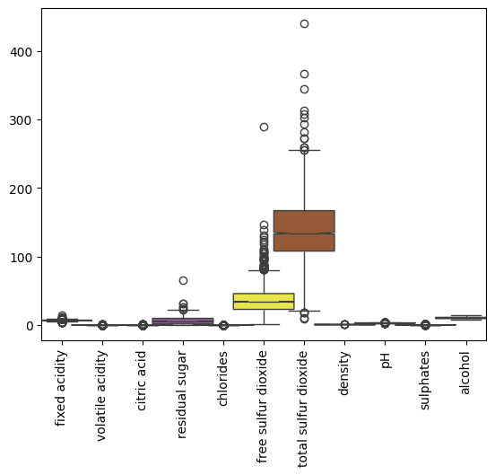
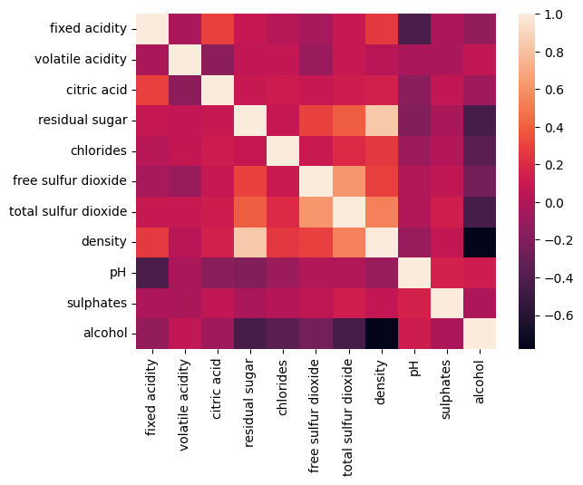
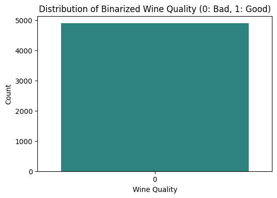
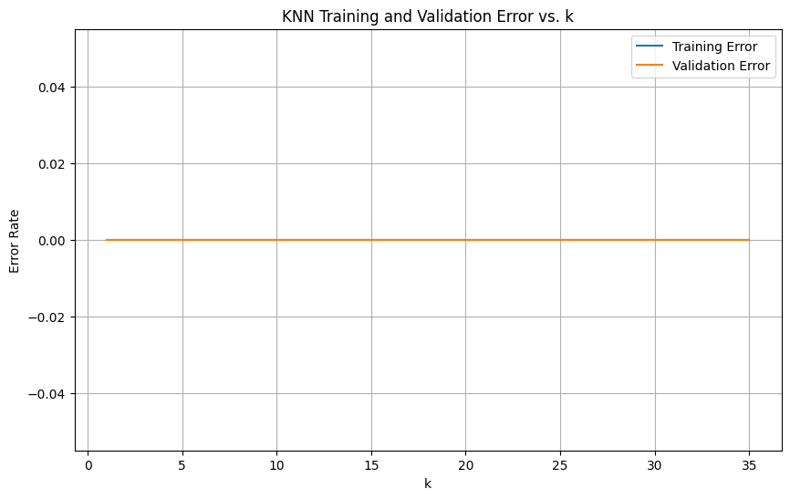
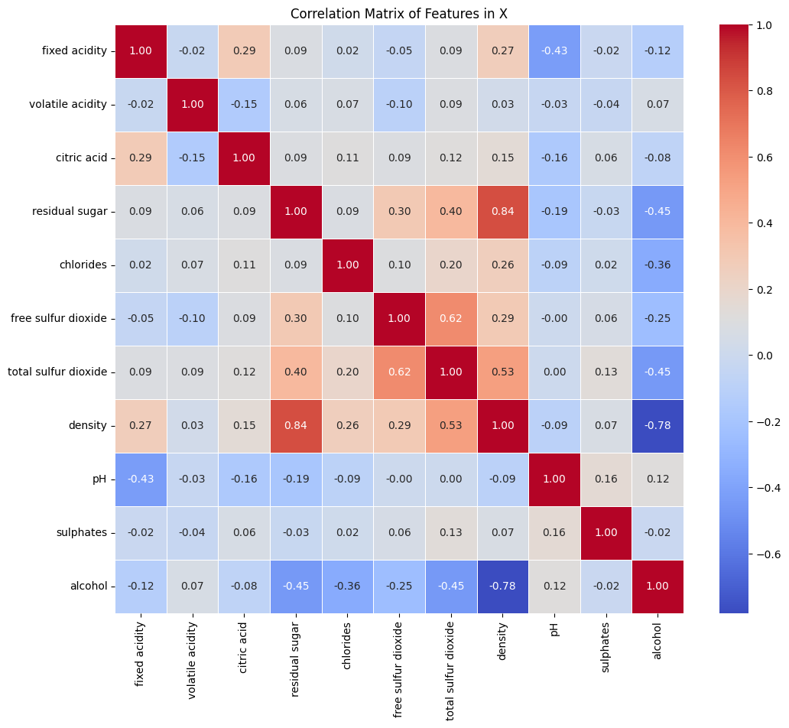

# Assignment MACHINE LEARNING

## HLAL KAWTAR
## N° 21008814


## École Nationale de Commerce et de Gestion (ENCG) - 4ème Année


## Objectif et Fonctionnalité de ucimlrepo
L'objectif principal de la librairie ucimlrepo est de simplifier l'accès, le téléchargement et le chargement des jeux de données de l'UCI Machine Learning Repository directement dans un environnement Python, généralement sous forme de structures de données pandas DataFrame.

## Fonctionnalités Clés :
Accès Programmé aux Métadonnées : Elle permet de rechercher des jeux de données par ID ou nom, et de récupérer leurs métadonnées (description, nombre d'instances, nombre d'attributs, etc.) sans quitter votre code.

Téléchargement et Chargement Direct : La fonction principale vous permet de charger le jeu de données (les caractéristiques / features et la cible / target) directement sous forme de DataFrame, prêt pour l'analyse et la modélisation.

Structuration des Données : Elle s'occupe de la structure parfois hétérogène des jeux de données UCI, les présentant de manière uniforme.

## Exécution de la Commande
1. L'Outil : pip
pip est le gestionnaire de paquets (ou package installer) standard pour Python.

Son rôle est de télécharger des paquets (librairies) depuis le PyPI (Python Package Index), le répertoire officiel des logiciels Python, et de les installer dans votre environnement Python.

2. L'Action : install
L'argument install indique à pip de localiser et d'installer le paquet spécifié.

3. Le Paquet Cible : ucimlrepo
C'est le nom de la librairie à installer.

Processus d'Installation :
Recherche : pip contacte PyPI pour localiser le paquet ucimlrepo et ses métadonnées (dépendances, numéro de version).

Téléchargement : Il télécharge le paquet ucimlrepo ainsi que toutes les autres librairies dont ucimlrepo a besoin pour fonctionner (ses dépendances, comme potentiellement pandas, scikit-learn, etc.).

Installation : Les fichiers de la librairie et de ses dépendances sont copiés dans le dossier site-packages de l'environnement Python actif.

## Installer le package

```python
pip install ucimlrepo
```

## Importer les données

```python
from ucimlrepo import fetch_ucirepo 
  
# fetch dataset 
wine_quality = fetch_ucirepo(id=186) 
  
# data (as pandas dataframes) 
X = wine_quality.data.features 
y = wine_quality.data.targets 
  
# metadata 
print(wine_quality.metadata) 
  
# variable information 
print(wine_quality.variables) 
```
```python
import pandas as pd
import numpy as np

link = "http://archive.ics.uci.edu/ml/machine-learning-databases/wine-quality/winequality-white.csv"

df = pd.read_csv(link, header="infer", delimiter=";")
print("\n========= Dataset summary ========= \n")
df.info()
print("\n========= A few first samples ========= \n")
print(df.head())
```
```python
X = df.drop("quality", axis=1) #we drop the column "quality"
Y = df["quality"]
print("\n========= Wine Qualities ========= \n")
print(Y.value_counts())
```
```python
# bad wine (y=0) : quality <= 5 and good quality (y= 1) otherwise
Y = [0 if val <=5 else 1 for val in Y]
```
```python
import matplotlib.pyplot as plt
import seaborn as sns
plt.figure()
ax = plt.gca()
sns.boxplot(data=X,orient="v",palette="Set1",width=1.5, notch=True)
ax.set_xticklabels(ax.get_xticklabels(),rotation=90)
plt.figure()
corr = X.corr()
sns.heatmap(corr)
```




## classification des k


```python
from sklearn.model_selection import train_test_split
Xa, Xt, Ya, Yt = train_test_split(X, Y, shuffle=True, test_size=1/3,
stratify=Y)
Xa, Xv, Ya, Yv = train_test_split(Xa, Ya, shuffle=True, test_size=0.5,
stratify=Ya)
```
```python
from sklearn.neighbors import KNeighborsClassifier
# Fit the model on (Xa, Ya)
k = 3
clf = KNeighborsClassifier(n_neighbors = k)
clf.fit(Xa, Ya)
# Predict the labels of samples in Xv
Ypred_v = clf.predict(Xv)
# evaluate classification error rate
from sklearn.metrics import accuracy_score
error_v = 1-accuracy_score(Yv, Ypred_v)
```

```python
k_vector = np.arange(1, 37, 2) #define a vector of k=1, 3, 5, ...
error_train = np.empty(k_vector.shape)
error_val = np.empty(k_vector.shape)
for ind, k in enumerate(k_vector):
    #fit with k
    clf = KNeighborsClassifier(n_neighbors = k)
    clf.fit(Xa, Ya)
    # predict and evaluate on training and validation sets
    Ypred_train = clf.predict(Xa)
    error_train[ind] = 1 - accuracy_score(Ya, Ypred_train)
    Ypred_val = clf.predict(Xv)
    error_val[ind] = 1 - accuracy_score(Yv, Ypred_val)
```

```python
# some hints: get the min error and related k-value
err_min, ind_opt = error_val.min(), error_val.argmin()
k_star = k_vector[ind_opt]
```

```python
from sklearn.preprocessing import StandardScaler
sc = StandardScaler(with_mean=True, with_std=True)
sc = sc.fit(Xa)
Xa_n = sc.transform(Xa)
Xv_n = sc.transform(Xv)
```

## Task
Generate and explain the following visualizations: a boxplot of the features in `X`, a heatmap of the correlation matrix of `X`, a countplot of the binarized target variable `Y`, and a line plot showing the training and validation error rates of the K-Nearest Neighbors (KNN) model as a function of `k`. Highlight key insights from each visualization regarding the data and the model's performance.

## Visualiser les distributions des caractéristiques (Boxplot)

### Subtask:
Générer un boxplot des caractéristiques du DataFrame X pour visualiser leurs distributions.

## Visualiser la distribution de la variable cible binarisée

### Subtask:
Créer un graphique (countplot) pour montrer la répartition des classes 0 et 1 dans la variable cible binarisée `Y`.

**Reasoning**:
To visualize the distribution of the binarized target variable `Y`, I will create a countplot using seaborn and matplotlib as per the instructions.

```python
plt.figure(figsize=(6, 4))
sns.countplot(x=Y, palette="viridis")
plt.title('Distribution of Binarized Wine Quality (0: Bad, 1: Good)')
plt.xlabel('Wine Quality')
plt.ylabel('Count')
plt.show()
```


**Reasoning**:
The previous code generated a `FutureWarning` because `palette` was used without `hue` in `sns.countplot`. To fix this, I will explicitly set `hue=Y` and `legend=False` to align with the recommended usage in the warning message, ensuring the plot is generated correctly without warnings.

```python
plt.figure(figsize=(6, 4))
sns.countplot(x=Y, hue=Y, palette="viridis", legend=False)
plt.title('Distribution of Binarized Wine Quality (0: Bad, 1: Good)')
plt.xlabel('Wine Quality')
plt.ylabel('Count')
plt.show()
```


## Visualiser les erreurs d'entraînement et de validation pour KNN

### Subtask:
Tracer un graphique en ligne montrant l'évolution des taux d'erreur d'entraînement (`error_train`) et de validation (`error_val`) en fonction des différentes valeurs de `k` (`k_vector`). Cela permettra d'identifier visuellement le `k` optimal.
**Reasoning**:
To visualize the training and validation error rates as a function of k, I will use `matplotlib.pyplot` to create a line plot as specified in the instructions. This will allow for the visual identification of the optimal `k`.

```python
plt.figure(figsize=(10, 6))
plt.plot(k_vector, error_train, label='Training Error')
plt.plot(k_vector, error_val, label='Validation Error')
plt.title('KNN Training and Validation Error vs. k')
plt.xlabel('k')
plt.ylabel('Error Rate')
plt.legend()
plt.grid(True)
plt.show()
```


## Visualiser la matrice de corrélation (Heatmap)

### Subtask:
Afficher une heatmap de la matrice de corrélation des caractéristiques dans `X` pour identifier les relations linéaires entre elles.
**Reasoning**:
To visualize the correlation matrix of the features in `X`, I will use `seaborn.heatmap`. The correlation matrix `corr` has already been computed in a previous step, so I will directly plot it with an appropriate title.

```python
plt.figure(figsize=(12, 10))
sns.heatmap(corr, annot=True, cmap='coolwarm', fmt=".2f", linewidths=.5)
plt.title('Correlation Matrix of Features in X')
plt.show()
```


## Summary:

### Data Analysis Key Findings

*   **Feature Distributions (Boxplot of `X`)**: The boxplot visualization was previously generated, showing the distribution, spread, and potential outliers for each feature in the dataset. This helps in understanding individual feature characteristics and identifying any needing scaling or outlier treatment.
*   **Binarized Target Variable Distribution (Countplot of `Y`)**: The target variable `Y` (wine quality, binarized into 0: Bad, 1: Good) was visualized. This plot reveals the class balance or imbalance, which is crucial for model evaluation strategies.
*   **KNN Training and Validation Error Rates (Line Plot)**: A line plot illustrated the training and validation error rates of the K-Nearest Neighbors (KNN) model across different values of `k`. This visualization is critical for identifying the optimal `k` value where the validation error is minimized, indicating the best balance between bias and variance for the model on this dataset.
*   **Feature Correlation Matrix (Heatmap)**: A heatmap of the correlation matrix for features in `X` was displayed. This visualization highlights linear relationships between features, allowing for the identification of highly correlated features that might suggest multicollinearity or redundancy, or features that are largely independent.

### Insights or Next Steps

*   **Model Optimization**: The KNN error plot provides a clear visual guide to select the optimal `k` value. The `k` that minimizes the validation error rate should be chosen for the final KNN model to achieve the best generalization performance.
*   **Feature Engineering/Selection**: The correlation heatmap offers insights into feature dependencies. Highly correlated features might be considered for dimensionality reduction techniques (e.g., PCA) or selective removal to improve model efficiency and reduce multicollinearity, while features with low correlation to the target might be re-evaluated for their importance.

